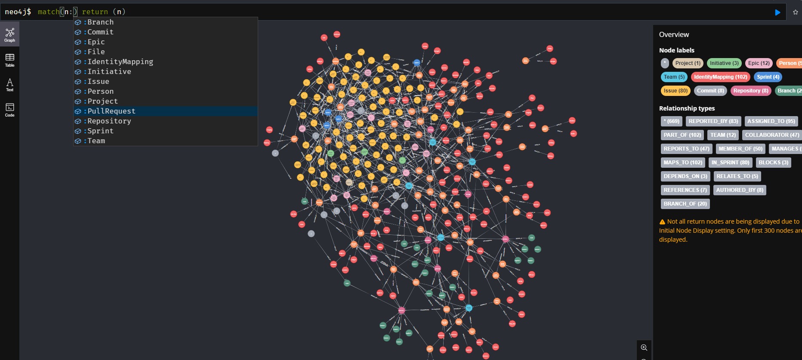

# Project Graph

A graph-based analytics platform that surfaces hidden data points from enterprise systems (GitHub, Jira, Confluence, Org Structure) to enable data-driven decision making for technical leaders.

## Overview

This project uses Neo4j graph database to model relationships between people, teams, projects, code repositories, and work items. By capturing these connections, it enables analysis of:
- Resource allocation and talent alignment
- Progress tracking and risk detection
- Team efficiency and bottlenecks
- Dependency chains and impact analysis

## Getting Started

1. **Quick Start**: See [quick-start.md](quick-start.md) for setting up Neo4j with Docker and basic setup
2. **Design Documentation**: Read [design/high-level-design.md](design/high-level-design.md) for the complete vision, data model, and use cases
3. **Simulation**: Check [simulation/graph-simulation.md](simulation/graph-simulation.md) for the test data generation and validation plan

